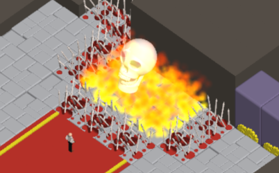

# JS13K 2022 - DEATHWISH

A game by Miguel Ángel Pérez Martínez.



Be careful what you wish for! Usually a tired old cliché but this time... well you can't be for sure if you don't complete the 13 amazing levels of this puzzle adventure!

Move around using the cursor keys and press R when you are stuck and want to retry the current level.

The game takes a good while to load, please be patient! Even if you think it doesn't it's doing its magic behind!


## Bonus! Script to generate your own progress bar with unicode characters!

Change 1234 with the amount of bytes you currently use and run!

```javascript
{k=1234/1024;for(i=f=0,s="";i<6;f=6*k/13-i,s+=f<=0?"🌑":["🌘","🌗","🌖","🌕"][((f>1?1:f)*3)|0],i++);`${s} ${(k*1000|0)/1000} KiB / 13 KiB #js13k`}
```
